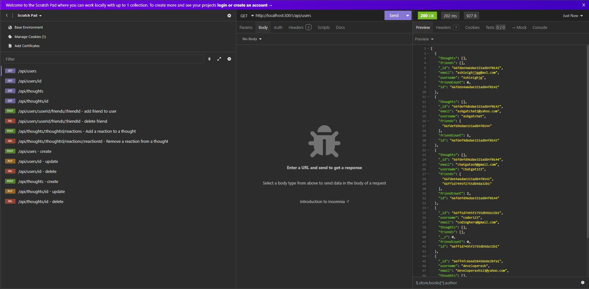
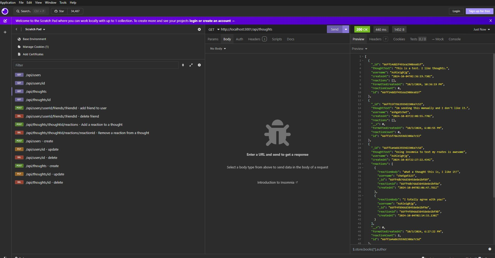
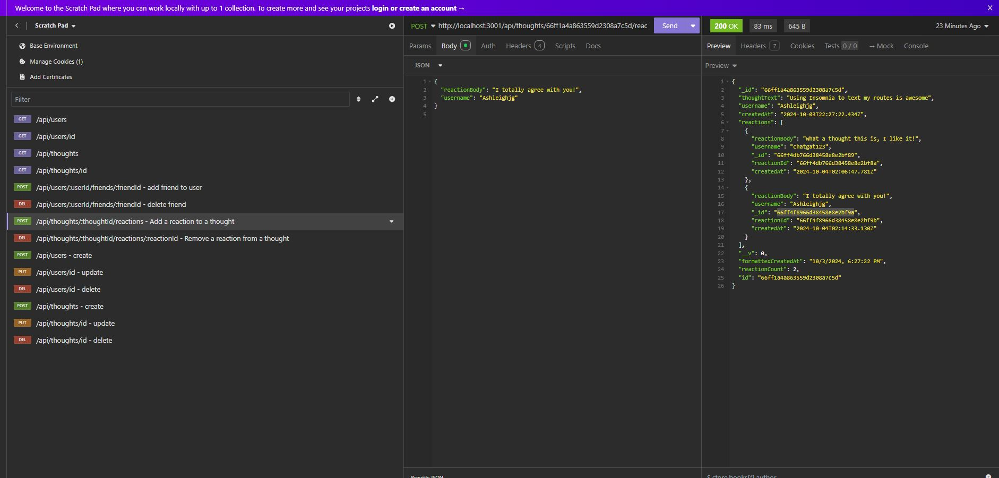

# social-network-api

## Description

This is a RESTful API for a social network web application where users can share their thoughts, react to friends' thoughts, and create a friend list. The API is built using Express.js for routing, MongoDB for the database, and Mongoose for object data modeling (ODM).

([Link to video walkthrough](https://drive.google.com/file/d/1r7PShxAOd5pF_BmccZ7gCnVwSuIWVrKA/view))

([Code source location](https://github.com/Ashleighjg/social-network-api))

## Table of Contents

- [Installation](#installation)
- [Usage](#usage)
- [License](#license)
- [Contributing](#contributing)
- [Tests](#tests)
- [Questions](#questions)

## Installation

N/A

## Usage

Tech Stack
- Node.js: JavaScript runtime environment.
- Express.js: Web framework for Node.js, used for routing.
- MongoDB: NoSQL database for storing users, thoughts, reactions, and friend lists.
- Mongoose: ODM library for MongoDB, allowing schema-based data modeling.

API Endpoints

Users

- GET /api/users - Retrieve a list of users.
- GET /api/users/:id - Retrieve a single product by ID.
- POST /api/users - Create a new product.
- PUT /api/users/:id - Update an existing product by ID.
- DELETE /api/users/:id - Delete a product by ID.

Thoughts

- GET /api/thoughts - Retrieve a list of thoughts.
- GET /api/thoughts/:id - Retrieve a single thought by ID.
- POST /api/thoughts - Create a new thought.
- PUT /api/thoughts/:id - Update an existing thoughts by ID.
- DELETE /api/thoughts/:id - Delete a thought by ID.

Friend Routes
- These routes are handled under the User routes, using /api/users/:userId/friends/:friendId.

Reaction Routes
- Reactions are stored as subdocuments of thoughts.

HTTP Method	Route	Description
- POST	/api/thoughts/:thoughtId/reactions - Add a reaction to a thought
- DELETE	/api/thoughts/:thoughtId/reactions/:reactionId	- Remove a reaction from a thought

## License

This project is licensed under the ([MIT](https://opensource.org/licenses/MIT)) license.

## Contributing

Portions of this code is sourced from Xpert Learning Assistant.

([Xpert Learning Assistant](https://bootcampspot.instructure.com/courses/6022/external_tools/313))

## Tests

N/A

## Questions

If you have any questions you can email me at Ashleighjg@gmail.com or contact me via Github username Ashleighjg.
